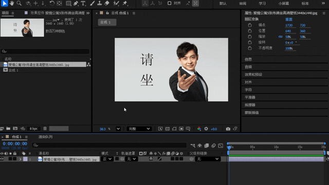

# 玄如意控制台 (XFXConsole)

**在 AE 里，用中文搜效果。**

按一下 `Ctrl + Space` 呼出，输入「高斯」或 `gsmh`，就能直接定位到 Gaussian Blur ——
不用记英文名，不用翻五层菜单。

还能把常用效果、脚本、预设、字体做成**按钮面板**，点一下直接用。

> Windows / macOS 双平台 · 装进 AE 插件目录即用 · 免费版永久免费，无水印、无时间限制

## 它解决什么问题

- 装了 200 个第三方插件，找某个效果要翻半天 → **一个快捷键搜出来**
- 效果菜单全是英文，想不起来叫什么 → **支持中文 / 拼音搜索**
- 每个项目都要从菜单里一层层找同一个效果 → **做成按钮，点一下就用**
- 常用脚本散落在各个目录，要背路径 → **自定义扫描源，自动收录**
- 换个电脑，配置全没了 → **WebDAV 云同步（免费版可用）**

## 主要功能

| 能力            | 说明                                                |
| --------------- | --------------------------------------------------- |
| 中文 / 拼音搜索 | 支持拼音首字母、全拼、中文混合搜索                  |
| 效果名中文显示  | 英文效果名可覆写为中文，不用背单词                  |
| 按钮面板        | 把常用效果 / 脚本 / 预设 / 字体做成按钮，点一下调用 |
| 拖拽排序        | 长按拖拽，按自己的习惯排列                          |
| 收藏夹          | 高频项随手收藏                                      |
| 云同步          | WebDAV 三向同步，多台机器同一套配置                 |
| 自定义扫描源    | 自定义路径扫描，把散落的脚本 / 预设纳入索引         |
| 图片导出        | 导出 png / jpg / webp / 剪贴板；合成导出            |
| 多语言界面      | 简体中文 / 繁体中文 / English / 日本語 / Русский    |
| 多主题          | 深色 / 绿 / 橙 / 粉                                 |

## 免费版与完整版

**免费版可以直接用，没有时间限制、不加水印。**

|              | 免费版            | 完整版（¥19.9 一次买断）  |
| ------------ | ----------------- | ------------------------- |
| 面板数量     | 1 个（20 个按钮） | 最多 128 个               |
| 图片导出     | 仅 png            | png / jpg / webp / 剪贴板 |
| 自定义扫描源 | 不支持            | 支持 glob 文件扫描        |
| 主题切换     | 固定深色          | 深色 / 绿 / 橙 / 粉       |
| 云同步       | ✅ 可用           | ✅ 可用                   |

> 完整版为**一次性买断，不是订阅，不用续费**。
> **支持退款**：购买后联系管理员（软件「关于」页有联系方式）办理。

## 下载与安装

**两种方式，任选一种：**

- ⚡ **一键安装（推荐，Windows）**：https://my.feishu.cn/wiki/N7GEwUmAWinqtTkzqvkcbRyfnCg
- 🐙 **手动下载（含 macOS）**：https://github.com/loyoi/xfxc/releases/latest

文件：

- Windows：`XFXConsole_<版本>.aex`
- macOS：`XFXConsole_<版本>.zip`

### Windows

1. 关闭 After Effects。
2. 下载 `.aex` 文件。
3. 复制到 `C:\Program Files\Adobe\Common\Plug-ins\7.0\MediaCore\LoYoi\`
   （`LoYoi` 文件夹不存在就自己新建；复制到 Program Files 需要管理员权限）
4. 重启 After Effects。

### macOS

1. 关闭 After Effects。
2. 解压 `.zip`，得到 `XFXConsole.plugin`。
3. 打开「访达 → 前往 → 前往文件夹」，输入
   `/Library/Application Support/Adobe/Common/Plug-ins/7.0/MediaCore`
   在该目录下新建 `LoYoi` 文件夹（若不存在），把 `.plugin` 放进去。
4. 重启 After Effects。

> ⚠️ **Mac 用户务必先做这一步**：`Ctrl + Space` 和 macOS 系统自带的「选择上一个输入源」
> 冲突，会导致快捷键按不出来。请去 **系统设置 → 键盘 → 键盘快捷键 → 输入法**，
> 取消勾选「选择上一个输入源」的 `Ctrl + Space`。否则你会以为插件没装上。

> **装不上？** 部分杀毒软件会对 `.aex` 插件（本质是 DLL）产生误报，这是这类插件的常见现象。
> 若被拦截，把插件目录加入杀软白名单即可。如仍无法安装，请在 Issues 里说明你的 AE 版本与系统。

## 系统要求

- Windows 10 / 11（x64）
- macOS（Intel / Apple Silicon 通用二进制）
- Adobe After Effects（支持 AEGP 的版本）

## 常见问题

**Q：和 FX Console 有什么区别？**
A：FX Console 是英文界面、英文效果名，中文用户得先想出英文才能搜。本插件支持**中文和拼音搜索**，
还能把效果名显示成中文。另外它有可自定义的按钮面板、自定义扫描源、云同步和多语言界面。
两者可以同时装，不冲突。

**Q：免费版有水印或时间限制吗？**
A：没有。免费版可以一直用，只是面板数量限 1 个（20 个按钮）。

**Q：买了之后换电脑还能用吗？**
A：可以。在线版绑定账号，支持迁移到新机器。

**Q：这是订阅制吗？**
A：不是。**一次性买断，不用续费。**
另有离线版 ¥9.9，绑定本机机器码、**仅限这一台电脑使用**；更换硬件会导致机器码变化，
届时需重新购买，且**离线版不支持退款**，请确认适用后再买。

**Q：退款怎么办？**
A：完整版支持退款。在软件「关于」页找到管理员联系方式，说明购买账号即可办理。
（离线版不支持退款。）

## 加入交流

- 💬 QQ 群：**552876393**（群文件常驻最新版，有问题随时问，我会回）
- 🐛 问题反馈：提 Issue

## 关于本仓库

本仓库仅用于分发文档与构建产物，不包含源代码。源码由作者私有维护。
